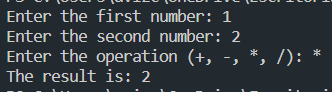

# BasicMathOperation
This repository hosts a JavaScript program for basic mathematical operations. Users input two numbers and an operation (+, -, *, /). The program calculates and displays the result. It's a simple project for understanding data I/O and number manipulation in Node.js.

